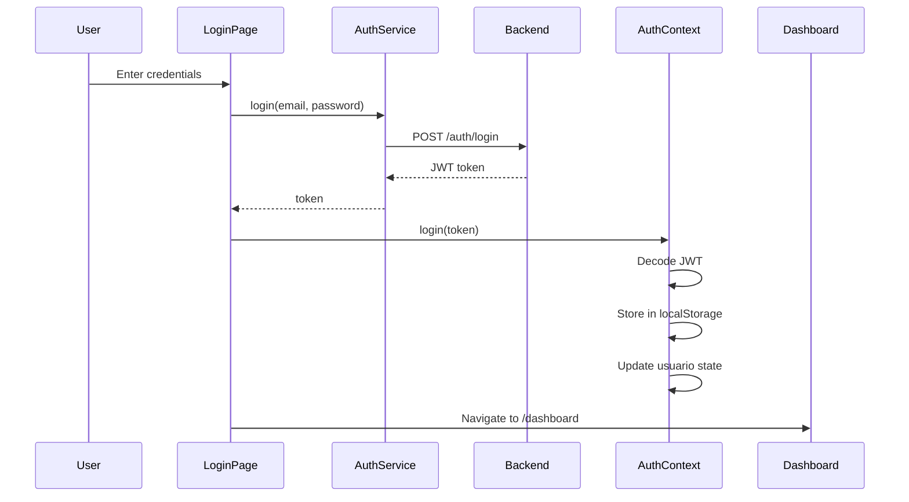

## Technology Overview

The Soraka frontend is built with modern React and tooling:

- **React**: 18.2.0
- **Build Tool**: Vite 7.2.4
- **Router**: React Router DOM 7.13.0
- **UI Framework**: Material Tailwind 2.1.10 + Tailwind CSS 3.4.17
- **HTTP Client**: Native Fetch API with custom wrapper

## Package Dependencies

From `package.json`:

### Production Dependencies

```json
{
  "react": "^18.2.0",
  "react-dom": "^18.2.0",
  "react-router-dom": "^7.13.0",
  "@material-tailwind/react": "^2.1.10",
  "@heroicons/react": "^2.2.0",
  "lucide-react": "^0.563.0",
  "jwt-decode": "^4.0.0"
}
```

### Development Dependencies

```json
{
  "vite": "^7.2.4",
  "@vitejs/plugin-react": "^5.1.1",
  "tailwindcss": "^3.4.17",
  "autoprefixer": "^10.4.23",
  "postcss": "^8.5.6",
  "eslint": "^9.39.1"
}
```

## Project Structure

```
frontend/src/
├── components/          # Reusable UI components
│   ├── auth/           # Authentication components
│   │   ├── LoginForm.jsx
│   │   └── ProtectedRoute.jsx
│   ├── home/           # Homepage components
│   │   ├── Footer.jsx
│   │   ├── Hero.jsx
│   │   └── NavBarDefault.jsx
│   └── user/           # User dashboard components
│       ├── CitasReservadas.jsx
│       ├── NavbarUsuario.jsx
│       ├── SaludoUsuario.jsx
│       ├── SelectorEspecialidad.jsx
│       └── TablaCitasDisponibles.jsx
├── contexts/           # React Context providers
│   └── AuthContext.jsx
├── pages/              # Page-level components
│   ├── Home.jsx
│   ├── Login.jsx
│   ├── Especialistas.jsx
│   └── user/
│       ├── DashboardUsuario.jsx
│       └── MisCitas.jsx
├── services/           # API client services
│   ├── api.js          # Base API configuration
│   ├── authService.js
│   ├── citaService.js
│   ├── especialidadService.js
│   ├── medicoService.js
│   └── usuarioService.js
├── assets/             # Static assets (images, icons)
├── App.jsx             # Root component with routing
├── main.jsx            # Application entry point
└── index.css           # Global styles
```

## Application Architecture

### Routing Structure

Defined in `App.jsx`:

```jsx
<BrowserRouter>
  <AuthProvider>
    <Routes>
      {/* Public routes */}
      <Route path="/" element={<Home />} />
      <Route path="/login" element={<Login />} />
      <Route path="/especialistas" element={<Especialistas />} />
      
      {/* Protected routes (PACIENTE role) */}
      <Route 
        path="/dashboard"
        element={
          <ProtectedRoute allowedRoles={["PACIENTE"]}>
            <DashboardUsuario />
          </ProtectedRoute>
        }
      />
      <Route 
        path="/mis-citas"
        element={
          <ProtectedRoute allowedRoles={["PACIENTE"]}>
            <MisCitas />
          </ProtectedRoute>
        }
      />
    </Routes>
  </AuthProvider>
</BrowserRouter>
```

### Pages

<AccordionGroup>
  <Accordion title="Home.jsx">
    Landing page with:
    - Navigation bar
    - Hero section
    - Footer
    - Links to login and specialists
  </Accordion>
  
  <Accordion title="Login.jsx">
    Authentication page:
    - Email and password form
    - Calls `/auth/login` endpoint
    - Stores JWT token on success
    - Redirects to dashboard
  </Accordion>
  
  <Accordion title="Especialistas.jsx">
    Public page showing:
    - List of medical specialists
    - Filtered by specialty
    - Doctor information (public profile)
  </Accordion>
  
  <Accordion title="DashboardUsuario.jsx">
    Patient dashboard:
    - Welcome message with user info
    - Specialty selector
    - Table of available appointments
    - Booking functionality
  </Accordion>
  
  <Accordion title="MisCitas.jsx">
    User's appointments page:
    - List of user's booked appointments
    - Appointment details
    - Cancel appointment option
  </Accordion>
</AccordionGroup>

## State Management

### AuthContext

Central authentication state management using React Context API.

**File**: `src/contexts/AuthContext.jsx`

```jsx
const AuthContext = createContext();

export function AuthProvider({ children }) {
  const [usuario, setUsuario] = useState(() => {
    // Load user from localStorage token
    const token = localStorage.getItem("token");
    if (!token) return null;
    
    // Decode and validate token
    const decoded = jwtDecode(token);
    if (decoded.exp < Date.now() / 1000) {
      localStorage.removeItem("token");
      return null;
    }
    return decoded;
  });

  const login = (token) => {
    const decoded = jwtDecode(token);
    localStorage.setItem("token", token);
    setUsuario(decoded);
  };

  const logout = () => {
    localStorage.removeItem("token");
    setUsuario(null);
    navigate("/");
  };

  return (
    <AuthContext.Provider value={{ usuario, login, logout, apiFetch }}>
      {children}
    </AuthContext.Provider>
  );
}
```

**Context Values**:

- `usuario`: Decoded JWT payload with user info (name, email, role)
- `login(token)`: Stores token and updates user state
- `logout()`: Clears token and redirects to home
- `apiFetch`: Authenticated fetch wrapper (auto-includes token)

**Usage**:

```jsx
import { useAuth } from '../contexts/AuthContext';

function MyComponent() {
  const { usuario, logout, apiFetch } = useAuth();
  
  // usuario.name, usuario.email, usuario.rol
  // apiFetch('/api/citas/mis-citas')
}
```

### Component State

Local state managed with `useState` hook:

```jsx
const [citas, setCitas] = useState([]);
const [loading, setLoading] = useState(false);
const [error, setError] = useState(null);
```

## API Services

Service modules encapsulate API calls:

### Base API Configuration

**File**: `src/services/api.js`

```javascript
const BASE_URL = 'http://localhost:8080';

export function crearApiFetch(logout) {
  return async (url, options = {}) => {
    const token = localStorage.getItem('token');
    
    const response = await fetch(`${BASE_URL}${url}`, {
      ...options,
      headers: {
        'Content-Type': 'application/json',
        ...(token && { Authorization: `Bearer ${token}` }),
        ...options.headers,
      },
    });
    
    if (response.status === 401) {
      logout(); // Auto-logout on unauthorized
    }
    
    return response;
  };
}
```

### Service Examples

<CodeGroup>
```javascript citaService.js
export const obtenerCitasDisponibles = async (apiFetch) => {
  const response = await apiFetch('/api/citas/disponibles');
  return response.json();
};

export const reservarCita = async (apiFetch, citaId, usuarioId) => {
  const response = await apiFetch(`/api/citas/${citaId}/reservar`, {
    method: 'POST',
    body: JSON.stringify({ usuarioId }),
  });
  return response.json();
};
```

```javascript authService.js
export const login = async (email, password) => {
  const response = await fetch('http://localhost:8080/auth/login', {
    method: 'POST',
    headers: { 'Content-Type': 'application/json' },
    body: JSON.stringify({ email, password }),
  });
  return response.json();
};
```

```javascript medicoService.js
export const obtenerMedicosPublicos = async () => {
  const response = await fetch('http://localhost:8080/api/medicos/publicos');
  return response.json();
};
```
</CodeGroup>

## Component Patterns

### Protected Routes

**File**: `src/components/auth/ProtectedRoute.jsx`

Higher-order component that guards routes based on authentication and role:

```jsx
export function ProtectedRoute({ children, allowedRoles }) {
  const { usuario } = useAuth();

  if (!usuario) {
    return <Navigate to="/login" replace />;
  }

  if (allowedRoles && !allowedRoles.includes(usuario.rol)) {
    return <Navigate to="/" replace />;
  }

  return children;
}
```

### Reusable Components

- **TablaCitasDisponibles**: Displays available appointments with booking action
- **CitasReservadas**: Shows user's booked appointments
- **SelectorEspecialidad**: Dropdown to filter by medical specialty
- **NavbarUsuario**: Authenticated user navigation with logout

## Styling Approach

### Tailwind CSS

Utility-first CSS framework for rapid UI development:

```jsx
<div className="min-h-screen bg-blue-gray-50">
  <button className="px-4 py-2 bg-blue-500 text-white rounded hover:bg-blue-600">
    Reservar Cita
  </button>
</div>
```

### Material Tailwind

Pre-built React components with Tailwind styling:

```jsx
import { Card, Button, Typography } from '@material-tailwind/react';

<Card className="p-6">
  <Typography variant="h5">Available Appointments</Typography>
  <Button color="blue">Book Now</Button>
</Card>
```

## Authentication Flow



## Build and Development

### Development Server

```bash
npm run dev
# Runs on http://localhost:5173
```

### Production Build

```bash
npm run build
# Outputs to dist/ directory
```

### Preview Production Build

```bash
npm run preview
```

## Next Steps

<CardGroup cols={2}>
  <Card title="Backend Architecture" icon="server" href="/architecture/backend">
    Understand the Spring Boot API that powers the frontend
  </Card>
  <Card title="Security" icon="shield" href="/architecture/security">
    Learn about JWT authentication and security implementation
  </Card>
</CardGroup>
