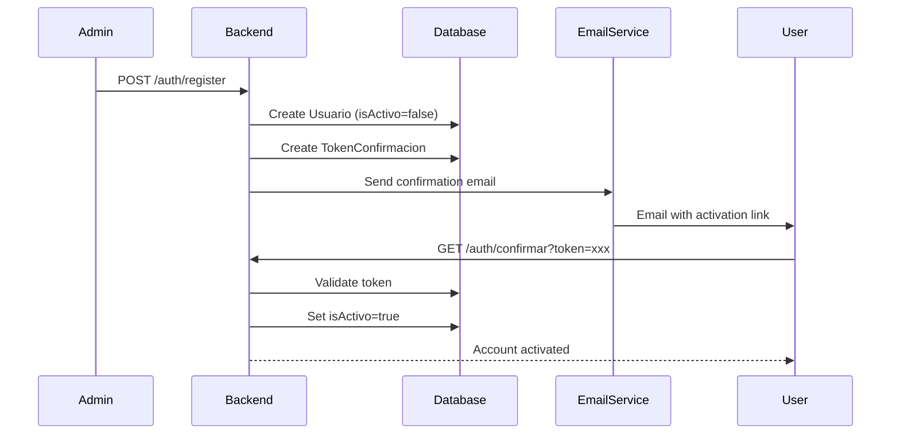
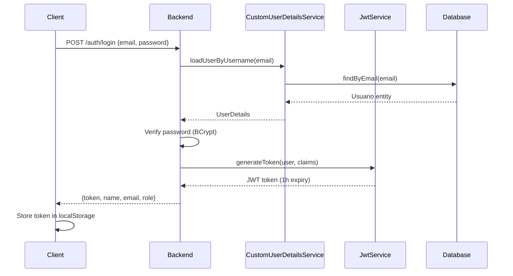
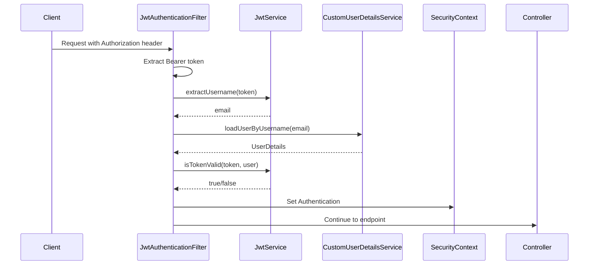

## Security Overview

Soraka implements a comprehensive security system using:

- **Spring Security 6.x**: Core security framework
- **JWT (JSON Web Tokens)**: Stateless authentication
- **BCrypt**: Password hashing algorithm
- **Role-Based Access Control (RBAC)**: Hierarchical permissions
- **Email Verification**: Account activation workflow

## Authentication Flow

### User Registration and Activation



### Login Flow



### Authenticated Request Flow



## Security Configuration

### SecurityConfig.java

**Location**: `backend/src/main/java/com/hospital/Soraka/security/SecurityConfig.java`

Central security configuration class.

#### Password Encoding

```java
@Bean
public PasswordEncoder passwordEncoder() {
    return new BCryptPasswordEncoder();
}
```

**Lines 70-73**: BCrypt is used to hash passwords before storing in database.

#### Session Management

```java
.sessionManagement(sm -> 
    sm.sessionCreationPolicy(SessionCreationPolicy.STATELESS)
)
```

**Line 94**: Stateless sessions - no server-side session storage (JWT-based authentication).

#### CORS Configuration

```java
@Bean
public CorsConfigurationSource corsConfigurationSource() {
    CorsConfiguration config = new CorsConfiguration();
    config.setAllowedOrigins(List.of("http://localhost:5173"));
    config.setAllowedMethods(List.of("GET", "POST", "PATCH", "DELETE", "OPTIONS"));
    config.setAllowedHeaders(List.of("*"));
    config.setAllowCredentials(true);
    
    UrlBasedCorsConfigurationSource source = new UrlBasedCorsConfigurationSource();
    source.registerCorsConfiguration("/**", config);
    return source;
}
```

**Lines 164-175**: Allows frontend (localhost:5173) to make cross-origin requests to backend API.

#### Role Hierarchy

```java
@Bean
public RoleHierarchy roleHierarchy() {
    RoleHierarchyImpl hierarchy = new RoleHierarchyImpl();
    hierarchy.setHierarchy(String.format("%s > %s \n %s > %s",
            ROLE_ADMIN, ROLE_MEDICO,
            ROLE_MEDICO, ROLE_PACIENTE));
    return hierarchy;
}
```

**Lines 206-213**: Defines role hierarchy:
- `ADMIN` inherits permissions from `MEDICO` and `PACIENTE`
- `MEDICO` inherits permissions from `PACIENTE`

## Authorization Rules

### Endpoint Security Configuration

Defined in `SecurityConfig.java:95-146`:

#### Public Endpoints (No Authentication Required)

```java
// CORS Preflight
auth.requestMatchers(HttpMethod.OPTIONS, "/**").permitAll();

// Authentication
auth.requestMatchers("/auth/login").permitAll();
auth.requestMatchers("/auth/confirmar/**").permitAll();

// Public Lists
auth.requestMatchers(HttpMethod.GET, "/api/usuarios/publico").permitAll();
auth.requestMatchers(HttpMethod.GET, "/api/medicos/publicos").permitAll();
auth.requestMatchers(HttpMethod.GET, "/api/especialidades/**").permitAll();
auth.requestMatchers(HttpMethod.GET, "/uploads/**").permitAll();
```

#### Role-Based Endpoints

```java
// User Registration (MEDICO or higher)
auth.requestMatchers(HttpMethod.POST, "/auth/register")
    .hasAuthority(ROLE_MEDICO);

// All other /api endpoints require authentication
auth.requestMatchers("/usuarios/**").authenticated();
auth.requestMatchers("/medicos/**").authenticated();
auth.requestMatchers("/citas/**").authenticated();
```

<Note>
Finer-grained authorization (e.g., ADMIN-only operations) is enforced at the service/controller level using `@PreAuthorize` annotations.
</Note>

### Authorization Summary Table

| Endpoint | Method | Access Level |
|----------|--------|-------------|
| `/auth/login` | POST | Public |
| `/auth/confirmar?token=...` | GET | Public |
| `/auth/register` | POST | MEDICO, ADMIN |
| `/api/usuarios` | GET | ADMIN |
| `/api/usuarios/publico` | GET | Public |
| `/api/usuarios/{id}` | GET | ADMIN or self |
| `/api/usuarios/{id}` | PATCH | ADMIN |
| `/api/usuarios/{id}` | DELETE | ADMIN |
| `/api/medicos` | GET | ADMIN |
| `/api/medicos/publicos` | GET | Public |
| `/api/medicos` | POST/PATCH/DELETE | ADMIN |
| `/api/especialidades` | GET | Public |
| `/api/especialidades` | POST/PATCH/DELETE | ADMIN |
| `/api/citas` | GET | ADMIN |
| `/api/citas/disponibles` | GET | Authenticated |
| `/api/citas/mis-citas` | GET | PACIENTE |
| `/api/citas` | POST/PATCH/DELETE | MEDICO, ADMIN |
| `/api/citas/{id}/reservar` | POST | PACIENTE |
| `/api/citas/{id}/cancelar` | POST | Authenticated |

## JWT Implementation

### JwtService.java

**Location**: `backend/src/main/java/com/hospital/Soraka/security/JwtService.java`

#### Token Generation

```java
public String generateToken(UserDetails user, Map<String, Object> claims) {
    return Jwts.builder()
            .setClaims(claims)
            .setSubject(user.getUsername())
            .setIssuedAt(new Date())
            .setExpiration(new Date(System.currentTimeMillis() + 1000 * 60 * 60))
            .signWith(Keys.hmacShaKeyFor(SECRET_KEY.getBytes()))
            .compact();
}
```

**Lines 44-52**: Creates JWT with:
- **Subject**: User's email (username)
- **Claims**: Additional user info (name, role, email)
- **Issued At**: Current timestamp
- **Expiration**: 1 hour from issuance (3600 seconds)
- **Signature**: HMAC-SHA with secret key

#### Token Validation

```java
public boolean isTokenValid(String token, UserDetails userDetails) {
    final String username = extractUsername(token);
    return (username.equals(userDetails.getUsername())) && !isTokenExpired(token);
}
```

**Lines 79-82**: Validates token by:
1. Extracting username from token
2. Comparing with provided UserDetails
3. Checking token hasn't expired

#### Username Extraction

```java
public String extractUsername(String token) {
    return Jwts.parserBuilder()
            .setSigningKey(SECRET_KEY.getBytes())
            .build()
            .parseClaimsJws(token)
            .getBody()
            .getSubject();
}
```

**Lines 60-67**: Extracts email (username) from JWT subject claim.

### JWT Token Structure

Example decoded JWT payload:

```json
{
  "sub": "patient@example.com",
  "name": "Juan Pérez",
  "email": "patient@example.com",
  "rol": "PACIENTE",
  "iat": 1709734800,
  "exp": 1709738400
}
```

- `sub`: Email (subject/username)
- `name`: User's display name
- `email`: User's email
- `rol`: User's role (ADMIN, MEDICO, PACIENTE)
- `iat`: Issued at timestamp
- `exp`: Expiration timestamp (1 hour after `iat`)

## JWT Authentication Filter

### JwtAuthenticationFilter.java

**Location**: `backend/src/main/java/com/hospital/Soraka/security/JwtAuthenticationFilter.java`

This filter runs **once per request** before other security filters.

#### Filter Exclusions

```java
@Override
protected boolean shouldNotFilter(HttpServletRequest request) {
    String path = request.getRequestURI();
    return path.startsWith("/auth/login")
            || path.startsWith("/auth/confirmar");
}
```

**Lines 61-66**: Public endpoints bypass JWT validation.

#### Filter Logic

```java
@Override
protected void doFilterInternal(
    HttpServletRequest request,
    HttpServletResponse response,
    FilterChain filterChain
) throws ServletException, IOException {
    final String authHeader = request.getHeader("Authorization");

    if (authHeader == null || !authHeader.startsWith("Bearer ")) {
        filterChain.doFilter(request, response);
        return;
    }

    final String token = authHeader.substring(7);

    try {
        final String email = jwtService.extractUsername(token);

        if (email != null && SecurityContextHolder.getContext().getAuthentication() == null) {
            UserDetails user = userDetailsService.loadUserByUsername(email);

            if (jwtService.isTokenValid(token, user)) {
                UsernamePasswordAuthenticationToken auth =
                        new UsernamePasswordAuthenticationToken(
                                user, null, user.getAuthorities()
                        );
                SecurityContextHolder.getContext().setAuthentication(auth);
            }
        }
    } catch (Exception e) {
        logger.warn("No se pudo procesar el token JWT: " + e.getMessage());
    }

    filterChain.doFilter(request, response);
}
```

**Lines 88-133**: Filter workflow:
1. Extract `Authorization` header
2. Check for `Bearer ` prefix
3. Extract token (remove "Bearer " prefix)
4. Extract email from token
5. Load user from database
6. Validate token against user
7. Set authentication in SecurityContext
8. Continue filter chain

## Custom UserDetailsService

### CustomUserDetailsService.java

**Location**: `backend/src/main/java/com/hospital/Soraka/security/CustomUserDetailsService.java`

```java
@Service
public class CustomUserDetailsService implements UserDetailsService {
    private final UsuarioRepository usuarioRepository;

    @Override
    public UserDetails loadUserByUsername(String email) {
        return usuarioRepository.findByEmail(email)
                .orElseThrow(() -> new UsernameNotFoundException("Usuario no encontrado."));
    }
}
```

**Lines 38-42**: Loads user from database by email. The `Usuario` entity implements `UserDetails` interface.

## Usuario Entity as UserDetails

**Location**: `backend/src/main/java/com/hospital/Soraka/entity/Usuario.java`

```java
@Entity
public class Usuario implements UserDetails {
    // ... entity fields ...

    @Override
    public Collection<? extends GrantedAuthority> getAuthorities() {
        return List.of(new SimpleGrantedAuthority(rol.name()));
    }

    @Override
    public String getUsername() {
        return email;
    }

    @Override
    public boolean isEnabled() {
        return Boolean.TRUE.equals(isActivo);
    }
}
```

**Lines 139-154**: 
- `getAuthorities()`: Returns user's role as GrantedAuthority
- `getUsername()`: Returns email (used as username)
- `isEnabled()`: Returns `isActivo` status
- Other methods return `true` (account non-expired, non-locked, credentials non-expired)

## Password Security

Passwords are hashed using BCrypt:

```java
// In UsuarioService during registration
String hashedPassword = passwordEncoder.encode(plainPassword);
usuario.setPassword(hashedPassword);
```

BCrypt properties:
- **Adaptive hashing**: Configurable work factor (default 10 rounds)
- **Salt included**: Automatic salt generation and storage
- **One-way**: Cannot reverse hash to get original password

## Email Confirmation Tokens

### Token Generation

When a new user is registered:

1. `ConfirmacionService` generates a random UUID token
2. `TokenConfirmacion` entity stored in database with:
   - Token value
   - Associated `Usuario`
   - Expiration timestamp (typically 24 hours)
3. Email sent to user with confirmation link: `/auth/confirmar?token={uuid}`

### Token Validation

When user clicks confirmation link:

1. Backend receives token in query parameter
2. Looks up `TokenConfirmacion` in database
3. Validates token hasn't expired
4. Sets `Usuario.isActivo = true`
5. Deletes used token
6. Returns success response

## Security Best Practices

<CardGroup cols={2}>
  <Card title="Secret Key Management" icon="key">
    JWT secret key stored in environment variable `JWT_SECRET`, not hardcoded
  </Card>
  
  <Card title="Password Hashing" icon="lock">
    BCrypt with automatic salting, never store plaintext passwords
  </Card>
  
  <Card title="Token Expiration" icon="clock">
    JWT tokens expire after 1 hour, forcing re-authentication
  </Card>
  
  <Card title="CORS Configuration" icon="globe">
    Restricted to specific origins (frontend URL only)
  </Card>
  
  <Card title="CSRF Disabled" icon="shield">
    Safe for stateless API with JWT, CSRF not applicable
  </Card>
  
  <Card title="Role Hierarchy" icon="users">
    Permission inheritance reduces code duplication
  </Card>
</CardGroup>

## Security Vulnerabilities to Avoid

<Warning>
  **Production Checklist**:
  - Use strong, random JWT secret key (minimum 256 bits)
  - Enable HTTPS in production (disable HTTP)
  - Implement refresh tokens for long-lived sessions
  - Add rate limiting to prevent brute force attacks
  - Implement account lockout after failed login attempts
  - Use secure email service (not Gmail SMTP in production)
  - Validate and sanitize all user input
  - Keep dependencies updated (regular `mvn dependency:tree` checks)
</Warning>

## Next Steps

<CardGroup cols={2}>
  <Card title="Backend Architecture" icon="server" href="/architecture/backend">
    Learn about Spring Boot package structure and design patterns
  </Card>
  <Card title="Frontend Architecture" icon="react" href="/architecture/frontend">
    Understand how React frontend handles authentication state
  </Card>
</CardGroup>
