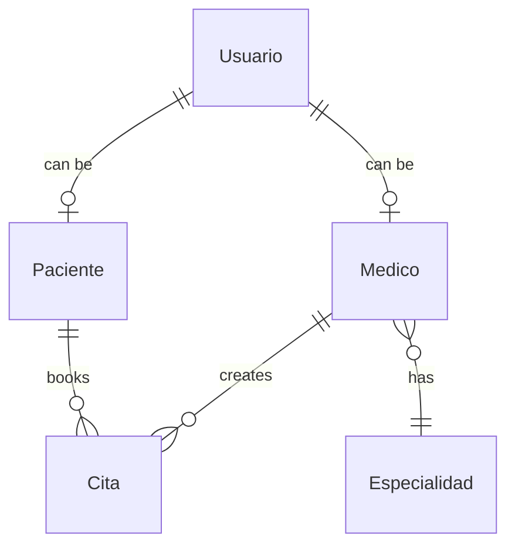

## Overview

Soraka uses MySQL 8.0 as its relational database, managed through Docker Compose. The database schema is automatically created and updated by Hibernate/JPA using the `ddl-auto=update` strategy.

## Database Configuration

### MySQL Version

```yaml docker-compose.yml
db:
  image: mysql:8.0
  container_name: soraka-mysql
```

**Why MySQL 8.0?**
- Improved performance over MySQL 5.7
- Better JSON support
- Window functions and CTEs
- Default UTF-8 character set (utf8mb4)

### Database Name

The database is automatically created on container startup:

```yaml
environment:
  MYSQL_DATABASE: hospitaldb
```

**Database name**: `hospitaldb`

## Timezone Configuration

Soraka is configured to use the **Europe/Madrid** timezone across all layers:

### MySQL Container

```yaml docker-compose.yml
db:
  environment:
    TZ: Europe/Madrid
```

### Spring Boot Application

```yaml docker-compose.yml
backend:
  environment:
    TZ: Europe/Madrid
    JAVA_TOOL_OPTIONS: -Duser.timezone=Europe/Madrid
```

### Hibernate/JPA

```properties application.properties
spring.jpa.properties.hibernate.jdbc.time_zone=Europe/Madrid
```

### Connection String

```properties
spring.datasource.url=jdbc:mysql://db:3306/hospitaldb?useSSL=false&serverTimezone=Europe/Madrid&allowPublicKeyRetrieval=true
```

<Info>
  Consistent timezone configuration across all layers prevents date/time discrepancies in appointment bookings and user registrations.
</Info>

## Connection Configuration

### JDBC Connection String

The Spring Boot application connects to MySQL using:

```
jdbc:mysql://db:3306/hospitaldb?useSSL=false&serverTimezone=Europe/Madrid&allowPublicKeyRetrieval=true
```

**Connection parameters explained:**

<ParamField path="useSSL" type="boolean" default="false">
  Disables SSL for database connections. Acceptable for development in Docker's internal network.
  
  <Warning>
    Enable SSL for production deployments or when the database is on a separate server.
  </Warning>
</ParamField>

<ParamField path="serverTimezone" type="string" default="Europe/Madrid">
  Explicitly sets the timezone for the MySQL connection, avoiding timezone warnings.
</ParamField>

<ParamField path="allowPublicKeyRetrieval" type="boolean" default="true">
  Allows retrieval of public keys for SHA-256 password authentication (required for MySQL 8.0).
</ParamField>

### Connection Pool

Spring Boot uses HikariCP as the default connection pool:

```properties application.properties
spring.datasource.url=jdbc:mysql://db:3306/hospitaldb?useSSL=false&serverTimezone=UTC&allowPublicKeyRetrieval=true
spring.datasource.username=root
spring.datasource.password=root
spring.datasource.driver-class-name=com.mysql.cj.jdbc.Driver
```

<Info>
  The connection string in `docker-compose.yml` overrides the one in `application.properties` to use `Europe/Madrid` timezone.
</Info>

## Schema Management

### JPA/Hibernate Configuration

Soraka uses Hibernate to automatically manage database schema:

```properties application.properties
# DDL Auto Mode
spring.jpa.hibernate.ddl-auto=update

# SQL Logging
spring.jpa.show-sql=true
spring.jpa.properties.hibernate.format_sql=true

# Dialect
spring.jpa.database-platform=org.hibernate.dialect.MySQL8Dialect
```

### DDL Auto Modes

<ParamField path="ddl-auto" type="string" default="update">
  Controls how Hibernate handles database schema:
  
  - **`update`** (current): Creates tables if they don't exist and updates schema when entities change. **Does not drop columns or tables.**
  - **`create`**: Drops and recreates schema on every startup (data loss)
  - **`create-drop`**: Creates schema on startup, drops on shutdown
  - **`validate`**: Only validates schema, doesn't make changes
  - **`none`**: No schema management
  
  <Warning>
    `update` mode is safe for development but may leave orphaned columns. For production, consider using migration tools like Flyway or Liquibase.
  </Warning>
</ParamField>

### SQL Logging

Hibernate is configured to log all SQL statements:

```properties
spring.jpa.show-sql=true
spring.jpa.properties.hibernate.format_sql=true
```

View SQL logs in the backend container:

```bash
docker-compose logs -f backend | grep Hibernate
```

## Database Schema

The schema is automatically generated from JPA entities in the codebase. Main entities include:

- **Usuario** (Users): Patients, doctors, and administrators
- **Medico** (Doctors): Doctor profiles with specialties
- **Especialidad** (Specialties): Medical specialties
- **Cita** (Appointments): Appointment bookings
- **Paciente** (Patients): Patient profiles

### Entity Relationships



## Persistent Storage

### Named Volume

Database data is stored in a Docker named volume:

```yaml docker-compose.yml
volumes:
  mysql_data:

services:
  db:
    volumes:
      - mysql_data:/var/lib/mysql
```

**Location**: Docker manages the volume storage (typically `/var/lib/docker/volumes/soraka_mysql_data/_data` on Linux)

### Data Persistence

- Data persists across container restarts
- Data survives `docker-compose down`
- Data is deleted with `docker-compose down -v`

<Warning>
  Always backup your database before running `docker-compose down -v`.
</Warning>

## phpMyAdmin Access

phpMyAdmin provides a web interface for database management:

```yaml docker-compose.yml
phpmyadmin:
  image: phpmyadmin/phpmyadmin
  container_name: soraka-phpmyadmin
  ports:
    - "8081:80"
  environment:
    PMA_HOST: db
    PMA_ABSOLUTE_URI: http://localhost:8081/
    UPLOAD_LIMIT: 300M
```

### Accessing phpMyAdmin

<Steps>
  <Step title="Navigate to phpMyAdmin">
    Open your browser and go to:
    
    ```
    http://localhost:8081
    ```
  </Step>

  <Step title="Login">
    Use the MySQL root credentials:
    
    - **Username**: `root`
    - **Password**: Value of `MYSQL_ROOT_PASSWORD` from your `.env` file
  </Step>

  <Step title="Select database">
    Click on `hospitaldb` in the left sidebar to view tables and data.
  </Step>
</Steps>

### phpMyAdmin Features

- **Browse tables**: View and edit table data
- **Run SQL queries**: Execute custom SQL statements
- **Export data**: Backup database in SQL, CSV, or JSON formats
- **Import data**: Restore from backup files (up to 300MB)
- **User management**: Create and manage database users
- **Table structure**: View and modify table schemas

## Database Health Check

The database includes a health check to ensure it's ready before dependent services start:

```yaml docker-compose.yml
healthcheck:
  test: ["CMD", "mysqladmin", "ping", "-h", "localhost", "-p${MYSQL_ROOT_PASSWORD}"]
  interval: 10s
  timeout: 5s
  retries: 30
  start_period: 30s
```

**Health check behavior:**
- Runs every 10 seconds
- Waits up to 5 minutes for database to be ready (30 retries)
- Backend and phpMyAdmin wait for healthy status before starting

Check health status:

```bash
docker inspect soraka-mysql --format='{{.State.Health.Status}}'
```

## Database Operations

### Backup Database

#### Using Docker

```bash
# Backup to SQL file
docker exec soraka-mysql mysqldump -uroot -p"$MYSQL_ROOT_PASSWORD" hospitaldb > backup.sql

# Backup all databases
docker exec soraka-mysql mysqldump -uroot -p"$MYSQL_ROOT_PASSWORD" --all-databases > full_backup.sql
```

#### Using phpMyAdmin

1. Navigate to http://localhost:8081
2. Select `hospitaldb`
3. Click "Export" tab
4. Choose "Quick" or "Custom" export method
5. Select format (SQL recommended)
6. Click "Go" to download

### Restore Database

#### Using Docker

```bash
# Restore from SQL file
docker exec -i soraka-mysql mysql -uroot -p"$MYSQL_ROOT_PASSWORD" hospitaldb < backup.sql
```

#### Using phpMyAdmin

1. Navigate to http://localhost:8081
2. Select `hospitaldb`
3. Click "Import" tab
4. Choose your SQL file (max 300MB)
5. Click "Go" to restore

### Reset Database

<Warning>
  This will delete all data permanently.
</Warning>

```bash
# Stop services and remove volumes
docker-compose down -v

# Start services (fresh database)
docker-compose up -d
```

### Access MySQL CLI

```bash
# Connect to MySQL shell
docker exec -it soraka-mysql mysql -uroot -p"$MYSQL_ROOT_PASSWORD" hospitaldb

# Run queries
SHOW TABLES;
SELECT * FROM usuario;
```

## Troubleshooting

### Database connection refused

**Cause**: Database hasn't finished initializing.

**Solution**: Wait for health check to pass:

```bash
docker-compose logs db
```

Look for: `mysqld: ready for connections`

### "Access denied" error

**Cause**: Incorrect password or username.

**Solution**: 
1. Verify `.env` file has correct credentials
2. Ensure `MYSQL_ROOT_PASSWORD` matches `SPRING_DATASOURCE_PASSWORD`
3. Restart containers: `docker-compose restart`

### Tables not created

**Cause**: Hibernate DDL mode may be disabled.

**Solution**: Verify `application.properties`:

```properties
spring.jpa.hibernate.ddl-auto=update
```

Check backend logs:

```bash
docker-compose logs backend | grep -i "table"
```

### Timezone issues

**Cause**: Inconsistent timezone configuration.

**Solution**: Verify timezone is set in all three locations:
1. MySQL container `TZ` environment variable
2. Backend `JAVA_TOOL_OPTIONS`
3. Connection string `serverTimezone` parameter

### Data lost after restart

**Cause**: Volume was deleted.

**Solution**: 
- Use `docker-compose down` (without `-v`) to preserve data
- Implement regular backup schedule

## Production Recommendations

<Warning>
  The current configuration is optimized for development. For production:
  
  - Use a managed database service (AWS RDS, Google Cloud SQL, etc.)
  - Enable SSL/TLS encryption
  - Use dedicated database user (not root)
  - Implement automated backups
  - Use database migration tools (Flyway, Liquibase)
  - Change `ddl-auto` to `validate` or `none`
  - Enable slow query logs
  - Configure connection pooling limits
  - Set up monitoring and alerts
</Warning>

### Migration to Managed Database

To use an external database:

1. Update `SPRING_DATASOURCE_URL` in `.env`:
   ```env
   SPRING_DATASOURCE_URL=jdbc:mysql://your-db-host:3306/hospitaldb?useSSL=true&serverTimezone=Europe/Madrid
   ```

2. Remove the `db` service from `docker-compose.yml`

3. Update backend `depends_on` to remove database dependency

4. Configure firewall rules to allow backend access to database

### Database Performance Tuning

For better performance, consider:

- **Indexes**: Add indexes on frequently queried columns
- **Connection pooling**: Tune HikariCP settings
- **Query optimization**: Use projections and DTOs instead of loading full entities
- **Caching**: Enable Hibernate second-level cache with Redis