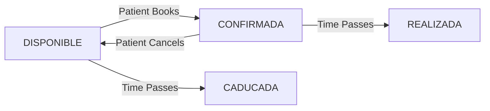

## Overview

The appointment system manages the entire lifecycle of medical appointments from creation through completion, with robust concurrency control and state management.

## Appointment States

Appointments flow through four distinct states:



### State Definitions

```java
public enum EstadoCita {
    DISPONIBLE,
    CONFIRMADA,
    REALIZADA,
    CADUCADA
}
```

Reference: EstadoCita.java:3-8

<AccordionGroup>
  <Accordion title="DISPONIBLE" icon="calendar-plus">
    - Appointment slot is available for booking
    - No patient assigned (`paciente = null`)
    - Created by doctors/admins or automated system
    - Future date/time only
  </Accordion>
  
  <Accordion title="CONFIRMADA" icon="calendar-check">
    - Patient has booked the appointment
    - Patient assigned with reason/motive
    - Can be cancelled back to DISPONIBLE
    - Automatically moves to REALIZADA after appointment time
  </Accordion>
  
  <Accordion title="REALIZADA" icon="circle-check">
    - Appointment was completed
    - Automatically set when CONFIRMADA appointment time passes
    - Final state - cannot be modified
  </Accordion>
  
  <Accordion title="CADUCADA" icon="calendar-xmark">
    - Available slot expired without being booked
    - Automatically set when DISPONIBLE appointment time passes
    - Final state - cannot be modified
  </Accordion>
</AccordionGroup>

## Appointment Entity

The `Cita` entity represents an appointment:

```java
@Entity
@Table(name = "citas", uniqueConstraints = {
    @UniqueConstraint(columnNames = {"medico_id", "fecha_hora"})
})
public class Cita {
    private Long id;
    private Usuario paciente;  // nullable for DISPONIBLE
    private Medico medico;     // required
    private LocalDateTime fechaHora;
    private EstadoCita estado;
    private String motivo;     // reason for appointment
    private Long version;      // for optimistic locking
}
```

Reference: Cita.java:11-45

<Note>
  The unique constraint `(medico_id, fecha_hora)` ensures a doctor cannot have multiple appointments at the same time.
</Note>

## Booking Flow

### 1. Viewing Available Appointments

Patients can list all available future appointments:

**Endpoint:** `GET /api/citas/disponibles`

**Permission:** PACIENTE, MEDICO, or ADMIN

```java
@GetMapping("/disponibles")
@PreAuthorize("hasAuthority('PACIENTE') or hasAuthority('MEDICO') or hasAuthority('ADMIN')")
public List<CitaResponseDTO> listarDisponibles() {
    return citaService.listarDisponibles();
}
```

Reference: CitaController.java:111-115

The service filters for available future appointments:

```java
return citaRepository.findByEstadoAndFechaHoraAfter(
    EstadoCita.DISPONIBLE,
    LocalDateTime.now()
).stream().map(this::buildResponse).toList();
```

Reference: CitaService.java:100-103

### 2. Booking an Appointment

Patients reserve an available appointment by providing their reason for the visit:

**Endpoint:** `POST /api/citas/{id}/reservar`

**Permission:** PACIENTE only

**Request:**
```json
{
  "motivo": "Consulta por dolor de cabeza persistente"
}
```

```java
@PostMapping("/{id}/reservar")
@PreAuthorize("hasAuthority('PACIENTE')")
public void reservarCita(
        @PathVariable Long id,
        @RequestBody @Valid ReservarCitaDTO dto,
        Authentication authentication
) {
    Usuario paciente = (Usuario) authentication.getPrincipal();
    citaService.reservarCita(id, paciente, dto);
}
```

Reference: CitaController.java:124-133

### Booking Logic

The service validates and updates the appointment:

```java
public void reservarCita(Long citaId, Usuario paciente, ReservarCitaDTO dto) {
    Cita cita = citaRepository.findById(citaId)
            .orElseThrow(() -> new CitaNotFoundException("Cita no encontrada"));

    if (cita.getEstado() != EstadoCita.DISPONIBLE) {
        throw new CitaNoDisponibleException("La cita no está disponible");
    }

    if (cita.getFechaHora().isBefore(LocalDateTime.now())) {
        throw new CitaNoDisponibleException("No se puede reservar una cita pasada");
    }

    cita.setPaciente(paciente);
    cita.setMotivo(dto.getMotivo());
    cita.setEstado(EstadoCita.CONFIRMADA);

    citaRepository.save(cita);
}
```

Reference: CitaService.java:231-248

<Warning>
  Appointments cannot be booked if they're in the past, even if the state is DISPONIBLE. This prevents race conditions with automated state updates.
</Warning>

## Cancellation Flow

Confirmed appointments can be cancelled and returned to the available pool:

**Endpoint:** `POST /api/citas/{id}/cancelar`

**Permission:** 
- PACIENTE (own appointments only)
- MEDICO (any appointment)
- ADMIN (any appointment)

```java
@PostMapping("/{id}/cancelar")
@PreAuthorize("hasAuthority('PACIENTE') or hasAuthority('MEDICO') or hasAuthority('ADMIN')")
public void cancelarCita(@PathVariable Long id, Authentication authentication) {
    Usuario usuario = (Usuario) authentication.getPrincipal();
    citaService.cancelarCita(id, usuario);
}
```

Reference: CitaController.java:141-146

### Cancellation Logic

```java
public void cancelarCita(Long citaId, Usuario paciente) {
    Cita cita = citaRepository.findById(citaId)
            .orElseThrow(() -> new CitaNotFoundException("Cita no encontrada"));

    if (cita.getEstado() != EstadoCita.CONFIRMADA) {
        throw new CitaNoCancelableException("Solo se pueden cancelar citas confirmadas");
    }

    // Permission check: patient can only cancel their own appointments
    if (cita.getPaciente() != null &&
            !cita.getPaciente().getId().equals(paciente.getId()) &&
            paciente.getRol() != Rol.MEDICO &&
            paciente.getRol() != Rol.ADMIN) {
        throw new AccessDeniedException("No puedes cancelar esta cita");
    }

    cita.setPaciente(null);
    cita.setMotivo(null);
    cita.setEstado(EstadoCita.DISPONIBLE);

    citaRepository.save(cita);
}
```

Reference: CitaService.java:256-276

<Tip>
  When an appointment is cancelled, it becomes available again for other patients to book.
</Tip>

## Creating Appointment Slots

Doctors and admins can create new available appointment slots:

**Endpoint:** `POST /api/citas`

**Permission:** MEDICO or ADMIN

**Request:**
```json
{
  "pacienteId": 5,
  "medicoId": 2,
  "fechaHora": "2026-03-15T10:00:00",
  "motivo": "Consulta general"
}
```

```java
@PostMapping
@PreAuthorize("hasAuthority('MEDICO') or hasAuthority('ADMIN')")
public CitaResponseDTO createCita(@RequestBody @Valid CitaPostDTO cita) {
    return citaService.createCita(cita);
}
```

Reference: CitaController.java:71-77

### Validation Rules

1. **Future dates only**: Cannot create appointments in the past
2. **No conflicts**: Doctor cannot have multiple appointments at same time
3. **Valid doctor**: Doctor must exist in system
4. **Valid patient**: Patient must exist (if specified)

```java
if (dto.getFechaHora().isBefore(LocalDateTime.now())) {
    throw new CitaNoDisponibleException("No se pueden crear citas en el pasado");
}

if (citaRepository.findByMedicoAndFechaHora(medico, dto.getFechaHora()).isPresent()) {
    throw new CitaOcupadaException("El médico ya tiene otra cita en esa fecha y hora");
}
```

Reference: CitaService.java:126-132

## Concurrency Control

### Optimistic Locking

The appointment entity uses JPA's `@Version` annotation for optimistic locking:

```java
@Version
private Long version;
```

Reference: Cita.java:44-45

<Note>
  Optimistic locking prevents race conditions when multiple users try to book the same appointment simultaneously. If a conflict occurs, the second user receives an error and must retry.
</Note>

### How It Works

1. User A reads appointment (version = 1)
2. User B reads same appointment (version = 1)
3. User A books appointment → version becomes 2
4. User B tries to book → JPA detects version mismatch → throws `OptimisticLockException`

### Unique Constraints

The database enforces uniqueness at the schema level:

```java
@Table(name = "citas", uniqueConstraints = {
    @UniqueConstraint(columnNames = {"medico_id", "fecha_hora"})
})
```

Reference: Cita.java:12

## Automated Management

### Automatic Slot Generation

The system automatically generates available appointment slots for all doctors:

**Schedule:** Daily at 1:00 AM

```java
@Scheduled(cron = "0 0 1 * * *")
public void generarCitasDisponibles() {
    List<Medico> medicos = medicoRepository.findAll();
    LocalDate hoy = LocalDate.now();
    
    for (Medico medico : medicos) {
        // Generate slots for next 7 days
        LocalDate fecha = hoy.plusDays(1);
        LocalDate fechaFin = hoy.plusDays(7);
        
        while (!fecha.isAfter(fechaFin)) {
            // 8:00 AM to 3:00 PM, every 30 minutes
            LocalDateTime hora = fecha.atTime(8, 0);
            LocalDateTime fin = fecha.atTime(15, 0);
            
            while (hora.isBefore(fin)) {
                if (!citaRepository.existsByMedicoAndFechaHora(medico, hora)) {
                    Cita cita = new Cita();
                    cita.setMedico(medico);
                    cita.setFechaHora(hora);
                    cita.setEstado(EstadoCita.DISPONIBLE);
                    citaRepository.save(cita);
                }
                hora = hora.plusMinutes(30);
            }
            fecha = fecha.plusDays(1);
        }
    }
}
```

Reference: CitaService.java:286-314

<Tip>
  Doctors have appointments automatically generated from 8:00 AM to 3:00 PM in 30-minute intervals for the next 7 days.
</Tip>

### Automatic State Updates

Past appointments are automatically updated:

**Schedule:** Every 30 seconds

```java
@Scheduled(fixedDelay = 30000)
public void cerrarCitasPasadas() {
    List<Cita> citasPasadas = citaRepository.findByFechaHoraBeforeAndEstadoIn(
        LocalDateTime.now(),
        List.of(EstadoCita.CONFIRMADA, EstadoCita.DISPONIBLE)
    );

    for (Cita c : citasPasadas) {
        if (c.getEstado() == EstadoCita.CONFIRMADA) {
            c.setEstado(EstadoCita.REALIZADA);
        } else {
            c.setEstado(EstadoCita.CADUCADA);
        }
    }

    citaRepository.saveAll(citasPasadas);
}
```

Reference: CitaService.java:324-343

## Viewing Appointments

### Patient's Appointments

**Endpoint:** `GET /api/citas/mis-citas`

**Permission:** PACIENTE

```java
@GetMapping("/mis-citas")
@PreAuthorize("hasAuthority('PACIENTE')")
public List<CitaResponseDTO> getMisCitas(Authentication authentication) {
    Usuario usuario = (Usuario) authentication.getPrincipal();
    return citaService.getCitasPorPaciente(usuario.getId());
}
```

Reference: CitaController.java:46-51

### All Appointments (Admin)

**Endpoint:** `GET /api/citas`

**Permission:** ADMIN only

```java
@GetMapping
@PreAuthorize("hasAuthority('ADMIN')")
public List<CitaResponseDTO> getTodasCitas(){
    return citaService.getTodasLasCitas();
}
```

Reference: CitaController.java:34-38

### Specific Appointment

**Endpoint:** `GET /api/citas/{id}`

**Permission:** MEDICO or ADMIN

```java
@GetMapping("/{id}")
@PreAuthorize("hasAuthority('MEDICO') or hasAuthority('ADMIN')")
public CitaResponseDTO getCitaById(@PathVariable Long id) {
    return citaService.getCitaById(id);
}
```

Reference: CitaController.java:59-63

## Response Format

Appointment responses include comprehensive information:

```java
public CitaResponseDTO buildResponse(Cita c) {
    return new CitaResponseDTO(
        c.getId(),
        c.getPaciente() != null ? c.getPaciente().getId() : null,
        c.getPaciente() != null ? c.getPaciente().getNombre() : null,
        c.getMedico().getId(),
        c.getMedico().getUsuario().getNombre(),
        c.getMedico().getEspecialidad().getNombre(),
        c.getFechaHora(),
        c.getEstado(),
        c.getMotivo()
    );
}
```

Reference: CitaService.java:351-363

**Example Response:**
```json
{
  "id": 123,
  "pacienteId": 45,
  "pacienteNombre": "Juan Pérez",
  "medicoId": 7,
  "medicoNombre": "Dra. María García",
  "especialidadNombre": "Cardiología",
  "fechaHora": "2026-03-15T10:00:00",
  "estado": "CONFIRMADA",
  "motivo": "Control de presión arterial"
}
```

## Best Practices

<CardGroup cols={2}>
  <Card title="Check Availability First" icon="magnifying-glass">
    Always query available slots before attempting to book
  </Card>
  
  <Card title="Handle Concurrency" icon="rotate">
    Implement retry logic for optimistic locking failures
  </Card>
  
  <Card title="Validate Dates" icon="calendar-check">
    Frontend should prevent selecting past dates
  </Card>
  
  <Card title="Clear Cancellation Policy" icon="info-circle">
    Inform patients about cancellation rules and timing
  </Card>
</CardGroup>

## Related Documentation

- [Doctors](/features/doctors) - Doctor entity and management
- [User Roles](/features/user-roles) - Permission levels for appointments
- [API Reference](/api/appointments/list) - Complete appointment endpoints
